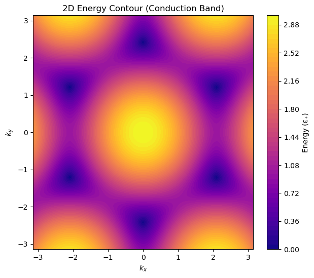
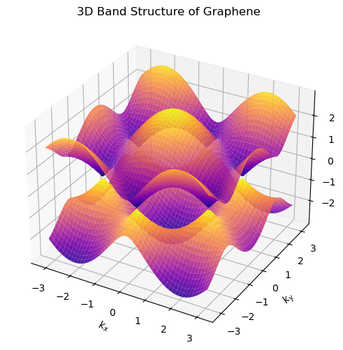
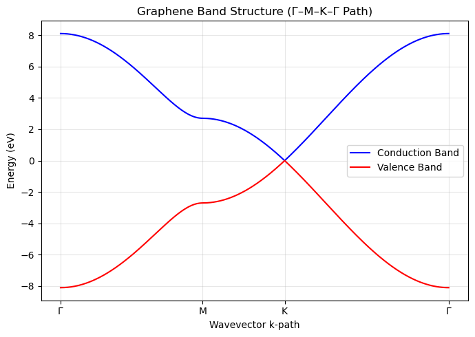
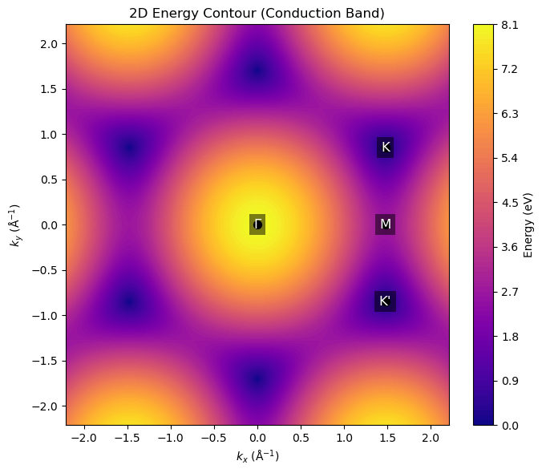

# 🧬 Graphene Band Structure (Tight-Binding)

A Python implementation of the **nearest-neighbor tight-binding model**
for graphene, visualizing its electronic band structure in multiple
representations.

This repository focuses on **clarity, reproducibility, and physical correctness**.

---

## 📊 Figures & Results

This code reproduces the key features of graphene’s electronic structure:

- **Linear Dirac cones** at the K and K′ points  
- **Particle–hole symmetric** conduction and valence bands  
- **Hexagonal symmetry** of the Brillouin zone  

**Available visualizations:**
- Band dispersion along high-symmetry path **Γ–M–K–Γ**
- Full **3D band structure**
- **2D energy contour** of the conduction band  







(Generated figures can be saved in the `figures/` directory.)

---

## 🧪 Scripts

Each script generates **one well-defined physical figure**:

- `scripts/plot_kpath_band.py`  
  → Band dispersion along the Γ–M–K–Γ path

- `scripts/plot_3d_band.py`  
  → 3D tight-binding band structure in the Brillouin zone

- `scripts/plot_2d_contour.py`  
  → 2D energy contour of the conduction band

All scripts use the **same underlying dispersion relation** for consistency.

---

## 🧠 Theory Background

We employ the **nearest-neighbor tight-binding Hamiltonian** for graphene,
leading to the dispersion relation

\[
E(\mathbf{k}) = \pm t \sqrt{
1 + 4\cos\left(\frac{\sqrt{3}k_y a}{2}\right)\cos\left(\frac{3k_x a}{2}\right)
+ 4\cos^2\left(\frac{\sqrt{3}k_y a}{2}\right)
}
\]

where:
- \( a \) is the carbon–carbon bond length  
- \( t \) is the nearest-neighbor hopping energy  

---

## ⚙️ Installation & Requirements

```bash
pip install -r requirements.txt
